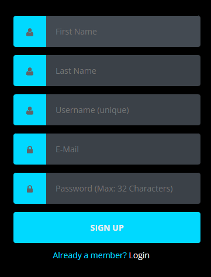
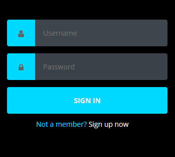

# Password Manager

A web-based password manager tool designed to save and retrieve user passwords. This project uses HTML, CSS, JavaScript for the frontend, PHP for the backend, and MySQL as the database. It is hosted on a local server using XAMPP.

## Table of Contents

- [Prerequisites](#prerequisites)
- [Steps to Execute](#steps-to-execute)
  - [Step 1: Set up XAMPP](#step-1-set-up-xampp)
  - [Step 2: Import Database](#step-2-import-database)
  - [Step 3: Place Source Code](#step-3-place-source-code)
  - [Step 4: Access the Application](#step-4-access-the-application)
- [Features](#features)
- [Screenshots](#screenshots)
- [Technologies Used](#technologies-used)
- [Notes](#notes)
- [License](#license)

## Prerequisites

1. **XAMPP** - Download from [XAMPP Official Website](https://www.apachefriends.org/download.html) for running the Apache server and MySQL.
2. **MySQL** - Local MySQL server used for storing passwords.

## Steps to Execute

### Step 1: Set up XAMPP
- Download and install XAMPP from the official website.
- Open the XAMPP control panel and start the **Apache** and **MySQL** servers.

### Step 2: Import Database
- Open the `data.sql` file and import it into your MySQL environment.
  - Alternatively, you can use **phpMyAdmin** by navigating to `http://localhost/phpmyadmin/` in your browser, selecting the "Import" tab, and uploading `data.sql`.

### Step 3: Place Source Code
- Place all source code files (except `data.sql`) into the `htdocs` folder of your XAMPP installation directory.

### Step 4: Access the Application
- Open your browser and navigate to `http://localhost/your-project-folder/homepage.html` to access the Password Manager homepage.

## Features

- **User Registration**: Allows users to create an account.
- **Login**: Secure login functionality.
- **Password Storage**: Allows users to save and retrieve passwords securely.

## Screenshots

| **Register Page**                           | **Login Page**                           |
|---------------------------------------------|------------------------------------------|
|  |  |

## Technologies Used

- **Frontend**: HTML, CSS, JavaScript
- **Backend**: PHP
- **Database**: MySQL
- **Server**: Apache (via XAMPP)

## Notes

- Ensure XAMPP is running and both Apache and MySQL servers are started.
- The project is designed to run on a local server (localhost).

## License

This project is open-source and free to use.
